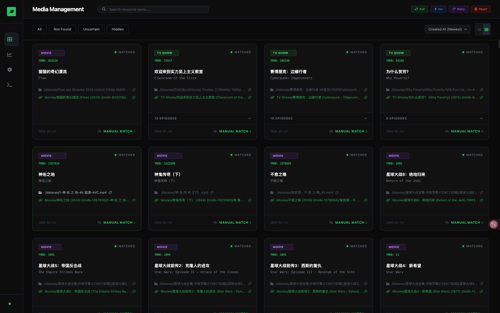

# NAS Infuse Helper (中文说明)

> 🚀 **本项目由 [Trae](https://trae.ai) SOLO 独立开发，耗时约 2 天业余时间。**

**NAS Infuse Helper** 是一款自动化的媒体库整理工具，专为解决 NAS 上混乱的下载目录而生。它能自动识别电影和剧集，整理成 Infuse (或 Plex/Emby/Jellyfin) 完美兼容的目录结构，且**完全不修改原始文件**。

它利用 **符号链接 (Symlink)** 技术，在保留原始文件位置和文件名（确保 P2P 做种不受影响）的同时，创建一个干净、规范的“影子媒体库”（例如：`Movies/阿凡达 (2009)/Avatar.mkv`，`TV Shows/绝命毒师/Season 1/S01E01.mkv`）。

## 🌟 核心功能



*   **无损整理**：使用符号链接，原始文件绝不被移动或重命名，完美支持 PT/BT 做种。
*   **自动刮削**：调用 TMDB API 自动识别电影和剧集信息。
*   **智能归档**：
    *   剧集自动重命名为标准的 `SxxExx` 格式。
    *   电影自动归类到 `中文名 (年份)` 的文件夹中。
    *   支持多文件电影（CD1/CD2）和复杂的嵌套文件夹结构。
*   **Web 控制台**：现代化的 Web 界面，可查看整理进度、统计数据，并手动修正未匹配的项目。
*   **强大的手动匹配**：
    *   支持关键词搜索。
    *   支持 TMDB ID 精确匹配 (`tmdb-12345`)。
    *   **强制类型匹配**：解决同名冲突，强制指定为电影 (`tmdb-movie-12345`) 或剧集 (`tmdb-tv-12345`)。
    *   **批量模式**：一键将匹配结果应用到同目录下的所有文件（非常适合整理整季剧集）。
*   **实时监控**：后台自动监控下载目录，新下载的文件会被秒级整理。
*   **路径映射**：支持复杂的网络挂载环境（例如 NAS 真实路径 `/volume1/data` 与服务器挂载路径 `/mnt/nas/data` 不一致的情况）。

## 🏗 架构与拓扑

本项目基于作者的实际使用场景开发，拓扑结构如下：

*   **存储层**：群晖 NAS (Synology)，负责下载和存储原始文件。
*   **计算层**：一台 i3 小服务器 (运行本工具)。
*   **播放层**：Apple TV (运行 Infuse)。

### 部署示意图

1.  **NAS**：将下载文件夹通过 NFS/SMB 共享给服务器。
2.  **服务器**：挂载 NAS 的共享文件夹。
    *   **源目录 (Source)**：`/mnt/nas/downloads` (混乱的原始下载目录)。
    *   **目标目录 (Target)**：`/mnt/nas/media_library` (整理后的媒体库)。
3.  **NAS Infuse Helper**：运行在服务器上。它扫描 `Source`，识别内容，并在 `Target` 中生成整理好的软链接。
4.  **Infuse (Apple TV)**：直接读取 `Target` 目录（通过 SMB/NFS/WebDAV 连接到服务器或 NAS）。由于是软链接，Infuse 能看到完美的目录结构并进行海报墙展示。

## 🚀 快速开始

### 前置要求

*   Python 3.9+
*   TMDB API Key (可在 [themoviedb.org](https://www.themoviedb.org/) 免费申请)
*   能访问到媒体文件的网络环境。

### 安装步骤

1.  克隆仓库：
    ```bash
    git clone https://github.com/XinShuichen/nas_infuse_helper.git
    cd nas_infuse_helper
    ```

2.  安装依赖：
    ```bash
    pip install -r requirements.txt
    ```

3.  配置：
    复制 `config.example.yaml` 为 `config.yaml` 并编辑：
    ```bash
    cp config.example.yaml config.yaml
    nano config.yaml
    ```
    *   `source_dir`: 你的原始下载目录路径。
    *   `target_dir`: 你希望生成的整理后目录路径。
    *   `tmdb_api_key`: 你的 TMDB API Key。
    *   `path_mapping`: (可选) 如果在 Docker 或跨设备挂载环境中使用，用于修正软链接的指向路径。

4.  运行：
    ```bash
    python3 main.py server
    ```
    启动后，访问 `http://localhost:5000` 即可进入 Web 控制台。

## 📖 使用说明书

详细操作指南请参阅 [用户手册 (中文)](docs/manual_cn.md)，内容包括：
*   **路径映射配置** (重要！必读)。
*   自动匹配的逻辑机制。
*   手动匹配的高级用法与语法。
*   剧集批量整理技巧。
*   常见问题排查。

## ⚠️ 协议警告

*   **推荐**: 请使用 **SMB** 或 **NFS** 协议将媒体库共享给 Infuse。
*   **避免**: 请勿使用 **WebDAV**。WebDAV 协议通常不支持符号链接，Infuse 将无法看到您的文件。

## 🤝 贡献指南

欢迎参与本项目开发！请参阅手册中的 [贡献指南](docs/manual_cn.md#贡献与开发)。

## 📄 许可证

本项目采用 MIT 许可证发布。详情请参阅 `LICENSE` 文件。

---
*Built with ❤️ by Trae AI.*
