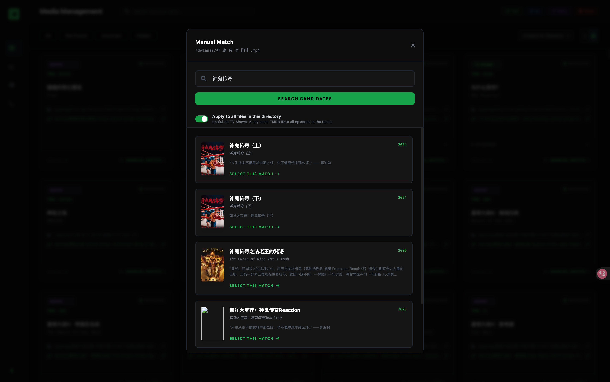
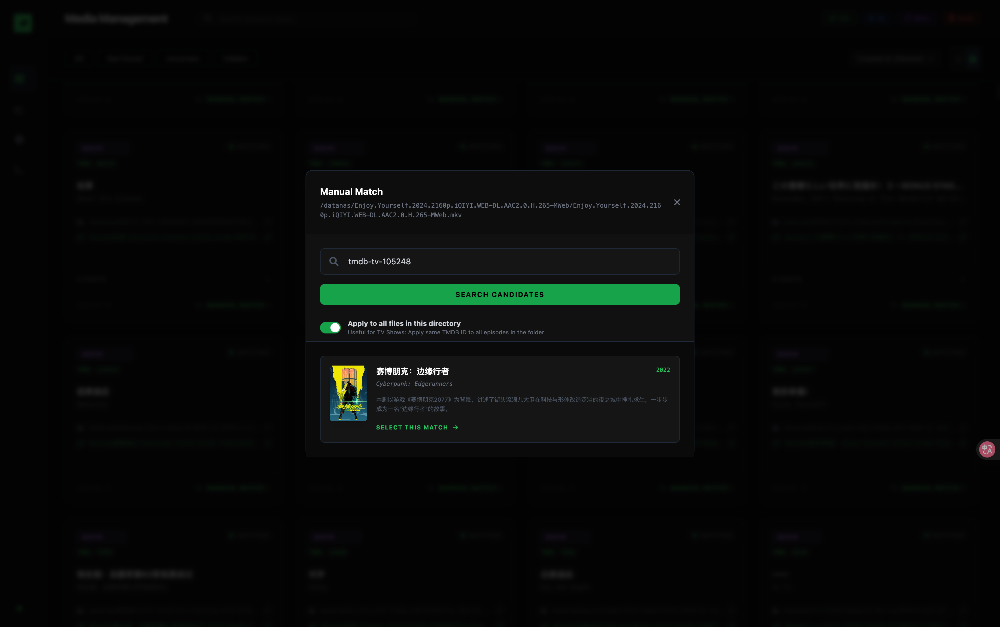

# User Manual

## Table of Contents
1.  [How Automatic Matching Works](#how-automatic-matching-works)
2.  [Manual Matching Guide](#manual-matching-guide)
3.  [Batch Processing](#batch-processing)
4.  [Advanced Configuration](#advanced-configuration)

---

## How Automatic Matching Works

The system continuously monitors your `source_dir`. When a new file is detected, it performs the following steps:

1.  **Scanning**: Identifies valid video files based on configured extensions (`.mp4`, `.mkv`, etc.).
2.  **Cleaning**: Analyzes the filename to remove noise (e.g., "BluRay", "x264", release group names) and extracts the core Title, Year, Season, and Episode information.
3.  **Searching**: Queries the TMDB API using the extracted title and year.
4.  **Matching**:
    *   It checks for exact matches on title and year.
    *   For TV Shows, it validates if the Season/Episode structure matches.
5.  **Linking**:
    *   If a high-confidence match is found, it creates a symbolic link in the `target_dir` with a clean, standardized name.
    *   If no match or low confidence, it marks the item as "Uncertain" or "Not Found" and waits for manual intervention.

---

## Manual Matching Guide

If a file is not matched automatically, you can manually fix it via the Web Dashboard.

### Basic Search
1.  Locate the item in the "Uncertain" or "Not Found" list.
2.  Click **Manual Match**.
3.  Enter the correct Movie/Show name in the search box.
4.  Select the correct candidate from the results.



### Advanced Syntax (Forced ID)
Sometimes TMDB search is tricky (e.g., duplicate names, remakes). You can force a specific match using TMDB IDs.



*   **Standard ID**: Enter `tmdb-12345` (Tries to find ID 12345 in the current category).
*   **Force Movie**: Enter `tmdb-movie-12345` (Forces system to treat this file as a Movie with ID 12345, even if it looks like a TV Show).
*   **Force TV Show**: Enter `tmdb-tv-12345` (Forces system to treat this file as a TV Show with ID 12345).

> **Tip**: You can find the ID in the URL of the TMDB website (e.g., `themoviedb.org/movie/63168` -> ID is 63168).

---

## Batch Processing

This feature is a lifesaver for organizing TV Shows where you have a folder full of episodes (e.g., `Season 1/`).

**Scenario**: You have a folder `/Downloads/Cyberpunk/` containing `Ep01.mkv`, `Ep02.mkv`, etc. The system failed to identify them.

**How to use:**
1.  Click **Manual Match** on *any one* of the files (e.g., `Ep01.mkv`).
2.  Search for "Cyberpunk Edgerunners" or enter `tmdb-tv-94605`.
3.  **Enable the "Apply to all files in this directory" checkbox.**
4.  Click Confirm.

**Result**:
The system will apply the selected Show ID (Cyberpunk) to **ALL** video files in that folder. It will intelligently assign Season/Episode numbers based on the filenames (or file order if filenames are obscure).

---

## Advanced Configuration

### Path Mapping
This is the most critical configuration. Please read carefully.

**The Core Issue**: A symlink is just a text string pointing to another path. If your Server (which creates the link) and your Player (Infuse/Apple TV) see the file paths differently, the link will be broken for the Player.

#### ⚠️ Important: Protocol Selection
*   ✅ **Use SMB or NFS**: Infuse supports symlinks well over these protocols.
*   ❌ **Avoid WebDAV**: WebDAV generally does not support symlinks. Infuse will not see them.

#### Scenario 1: Path Mapping Required (Recommended)
**Topology**: NAS stores files. Linux Server mounts NAS for processing. Infuse connects to NAS.

*   **Real NAS Path**: `/volume1/Media/Downloads` (Physical path on Synology).
*   **Server Mount Path**: `/mnt/nas/downloads` (Mounted via NFS on Linux Server).
*   **Infuse Connection**: Connects directly to Synology SMB. Sees `/Media/Downloads` or `/volume1/Media/Downloads`.

**Problem**: If the tool creates a link pointing to `/mnt/nas/downloads/movie.mkv`, Infuse will fail because it doesn't know what `/mnt/nas` is.

**Solution**:
Tell the tool: "When you see a file at `/mnt/nas/downloads`, make the symlink point to `/volume1/Media/Downloads` instead."

`config.yaml`:
```yaml
path_mapping:
  # "Server Path (Source)": "NAS Path (Target)"
  "/mnt/nas/downloads": "/volume1/Media/Downloads"
```

#### Scenario 2: No Mapping Required (Simplified)
If you don't want to deal with mapping, you can share the folder directly from the **Server** instead of the NAS.

1.  Server mounts NAS to `/mnt/nas/downloads`.
2.  Server creates symlinks in `/mnt/nas/media_library`.
3.  **Enable SMB on the Server** and share `/mnt/nas/media_library`.
4.  Infuse connects to the **Server's SMB**, not the NAS.

In this case, Infuse sees the same paths as the Server, so **no `path_mapping` is needed**.

---

## Contributing

Contributions are welcome! This project is currently co-developed with Trae AI.

### Development Setup
1.  Clone the repo.
2.  `pip install -r requirements.txt`
3.  `python main.py server`

### Guidelines
*   Submit Issues for bugs.
*   PRs are welcome for new features (e.g., Jellyfin support).
*   Keep code simple and clean.
